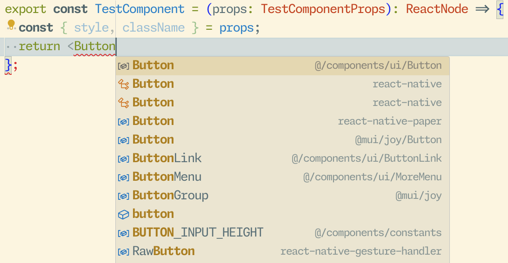
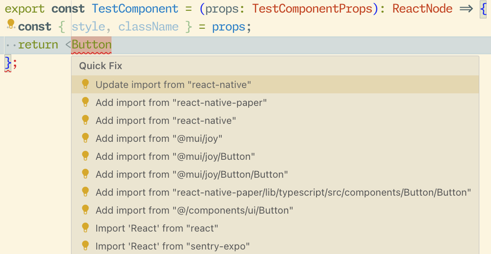
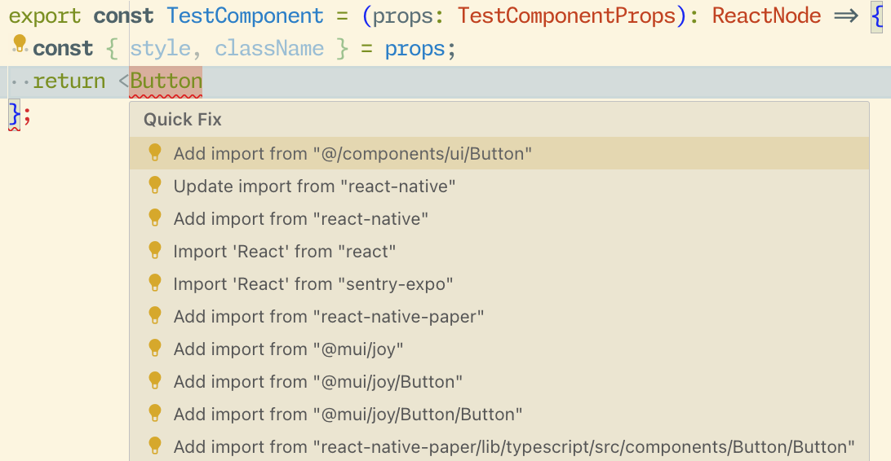
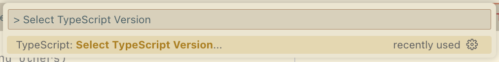
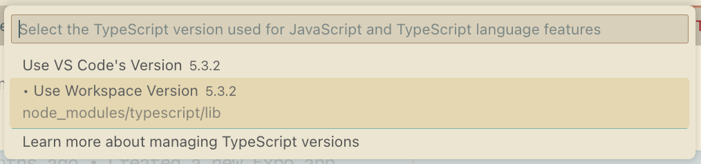

# TypeScript Sort Import Suggestions Plugin

A TypeScript plugin enables developers to customize the order of auto-import suggestions provided by the TypeScript Language Server. It should be compatible with any IDE or editor that utilizes the TypeScript Language Server.

|               | Before      |   After
| -----------   | ----------- | ----------- |
| Auto complete |  |  |
| Code Fix    |  |  |


## Setup

- Install package

    ```bash
    npm install ts-sort-import-suggestions-plugin
    ```

- Config `tsconfig.json`

    ```json
    {
      "compilerOptions": {
        "plugins": [
          {
            "name": "ts-sort-import-suggestions-plugin",
            // Matches `@/`, `../` and `./`, move them up in the suggestions (This is the default config if you leave it empty)
            "moveUpPatterns": ["@/", "\\\\.{1,2}/"],
            // Move `dist` down in the suggestions, by deafult it's `[]`
            "moveDownPatterns": ["dist"],
          }
        ]
      },
    }
    ```

- Config your Editor or IDE to use the TypeScript from node_modules (i.e. *Use Workspace Version* in VSCode), otherwise TypeScript won't be able to load the plugin
    - 
    - 

## Development

Please refer to [TypeScript / Writing a TypeScript Plugin](https://github.com/microsoft/TypeScript/wiki/Writing-a-Language-Service-Plugin)
